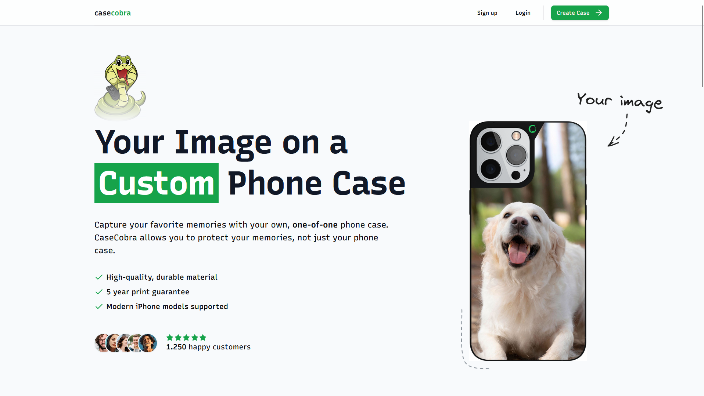

# CaseCobra - A Modern Fullstack E-Commerce Shop for Custom Phone Cases

## Overview
CaseCobra é uma loja e-commerce completa desenvolvida do zero usando o Next.js 14 App Router, Postgres, TypeScript, Tailwind e Kinde Auth. Este projeto é baseado no tutorial de [Josh tried coding](https://github.com/joschan21).

## Features
- 🛠️ **Loja Completa**: Construído do zero em Next.js 14
- 💳 **Painel de Admin Secreto**: Para gerenciar pedidos de forma eficiente
- 🖥️ **Uploads de Arquivos**: Funcionalidade de arrastar e soltar
- 🛍️ **Compras Diretas**: Os clientes podem comprar diretamente de você
- 🌟 **UI Moderna e Limpa**: Construído sobre shadcn-ui
- 🛒 **Configurador de Capas Personalizadas**: Totalmente customizável
- 🔑 **Autenticação com Kinde**: Garantindo segurança e praticidade
- ✉️ **E-mail de Agradecimento**: Bonito e informativo após a compra
- ⌨️ **100% em TypeScript**: Garantindo tipagem e segurança de dados

## Demo 
[CaseCobra](https://cobracase-liard.vercel.app/)
